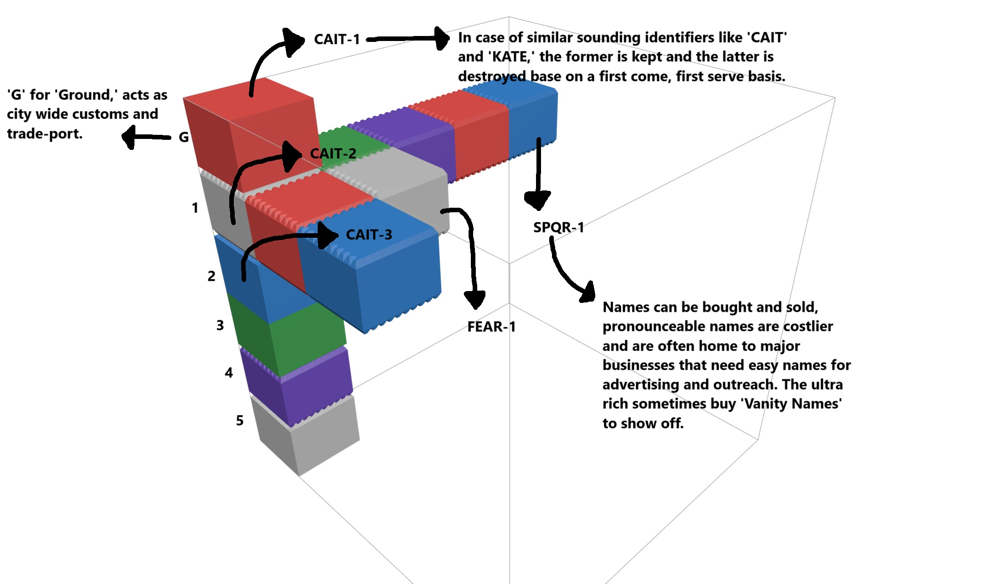

# Intra Terram (Within the Earth)

Roughly Circular Earthscraper—a multi-level megastructure that burrows deep into the earth just like
a skyscraper reaches for the sky.

**Radius**: ~16km (split into 250mx250mx10m squire blocks) [^2]

**Depth**: ~30km (split into 10m floors) [^1] [^4]

**Addressing**: The entire city is divided into 3D grid. Each block is located by an ID consisting
of four alphabets and the floor number [^3].

## Notable Locations

| Name                                | Owner                | Entrance           | Description                                                                                                                                                                                                                                                                                                                                                                          |
| ----------------------------------- | -------------------- | ------------------ | ------------------------------------------------------------------------------------------------------------------------------------------------------------------------------------------------------------------------------------------------------------------------------------------------------------------------------------------------------------------------------------ |
| Denny's Dive                        | Denny Deacon         | HOME793            | Dingy, dark, and damp. You definiltely don't want to pay too much attention to what you're sitting, sipping, or feeling under your fingers, but the food is good and the drinks are cheap. More importantly, Denny knows all. There is a reason she's the *sexta guardia*. [^5]                                                                                                      |
| Domus Imperatrix                    | Sister Millicent     | HOME794            | Entered through Denny's Dive, the Domus Imperatrix is both a luxurious mansion and office to Terram's best Fixer, Sister Millicent. This mansion is massive covering almost  2 entire block and 7 floors. Few are allowed beyond the spacious waiting area.                                                                                                                          |
| The Farms                           | Kikune Ikeda         | Lv.1000 to Lv.1027 | This is where 90% of Terram's food is produced. Entry into these floors is forbidden, workers remain tight-lipped and well-protected, trespassing means death. Ikeda, the *Primero Guardia* will not hesitate to declare *cessatio* [^6] until trespassers killed.                                                                                                                   |
| Church of The Most Holy Virgin Mary | Father Ryker Strauss | CAIT793            | A single Gothic building with a high arching ceiling, and a massive bell tower. Father Ryker is also one of the best ripperdocs for at least 20 levels. Getting a personal appointment from him requires that you win his admiration. You may get free repairs for health critical cyberware and civilian installs here as the church and clinic are funded by the *Novena Guardia*. |

[^2]: When doing [the math](https://math.stackexchange.com/a/3007768) for radius 18km, squire edge
    250m, you end up needing 4 alphabets to uniquely identify each block (3911 squires within 18km
    radius, 12^4 = 20736).

[^1]: The lowest layers of Terram are dangerously close to the earths mantel despite being on the
    [earth's continental crust](https://en.wikipedia.org/wiki/Earth%27s_crust#:~:text=The%20crust%20of%20Earth%20is,diabase%2C%20and%20gabbro.).
    Even with an extremely powerful cooling system, life is harsh. Should anything happen to the
    cooling systems, all life an machinery in the lower thousand levels would be destroyed due to
    [extreme ambient temperatures](<https://en.wikipedia.org/wiki/Earth%27s_crust#:~:text=The%20temperature%20of%20the%20crust%20increases%20with%20depth%2C%5B2%5D%20reaching%20values%20typically%20in%20the%20range%20from%20about%20100%C2%A0%C2%B0C%20(212%C2%A0%C2%B0F)%20to%20600%C2%A0%C2%B0C%20(1%2C112%C2%A0%C2%B0F)%20at%20the%20boundary%20with%20the%20underlying%20mantle.>).

[^4]: Not all floors are 10m thick. Sometimes, multiple floors are merged into one large open space
    usually for massive industrial works.

<!-- TODO: Update image, the addressing is wrong -->

[^3]: A schematic to help understand Terram's addressing system.

    |  |
    | :-------------------------------------------------------------------------: |
    |                          Terram's Adressing System                          |

[^5]: Terram is run by Sister Millicent (who usually works as a fixer), but for the most part,
    decisions are made and enforced by the *numero guardia*—A ruling council each with significant
    stake in the city without any interference or input from Sister Millicent.

    | Title             | Number | Name             | Controls                           |
    | ----------------- | :----: | ---------------- | ---------------------------------- |
    | Imperatrix Terra  |        | Sister Millicent | Everything                         |
    | *Primero Guardia* |   1    | Kikune Ikeda     | Food production                    |
    | *Segunda Guardia* |   2    | Lilynette Starkk | Military & SpecOps                 |
    | *Tercero Guardia* |   3    | Coyote Starkk    | Domestic Policing & Investigations |
    | *Quinta Guardia*  |   5    | Anya Smirnova    | Corporate Relations & Regulation   |
    | *Sexta Guardia*   |   6    | Denny Deacon     | Intelligence Operations            |
    | *Novena Guardia*  |   9    | Isa Del Rosario  | Health & Infrastructure            |

[^6]: Terram isn't as bad a capitalist hellscape like most of the rest of the world. This is primarily
    because of an active unbiased judiciary headed by the *Terecero Guardia*, and the death penalty
    for anti-unionization legislation put out by the *Imperatrix Terra*. While assassination and
    police brutality are employed, the *Arbiters* do not take kindly to to the use of fear as a tool
    of control. That makes declaration of *cessatio*—cessation of all services by that particular
    *Guardia*—a very powerful tool in the hands of the *Numero Guardia*.
